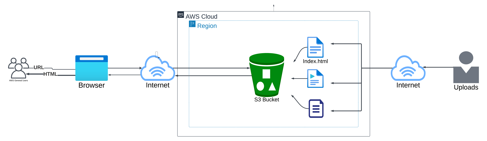

# Static Website Hosting on AWS S3

This project provides a step-by-step guide on how to host a static website using Amazon S3.

## Step 1: Creating the S3 Bucket

1. Sign in to the [AWS Management Console](https://aws.amazon.com/console/).
2. Open the Amazon S3 console at [https://console.aws.amazon.com/s3/](https://console.aws.amazon.com/s3/).
3. Click on **Create bucket**.
4. Choose a **Region** for your bucket.
5. Under the "Block Public Access settings for this bucket" section, uncheck the **Block all public access** checkbox and accept the acknowledgement.
6. Select **Disable** for Bucket Versioning.
7. (Optional) Add tags to your bucket for easy identification.
8. Under the "Default encryption" section, disable **Server-side encryption**.
9. Click on **Create bucket**.

## Step 2: Enabling Static Website Hosting

1. In the Buckets list, choose the name of the bucket that you want to enable static website hosting on.
2. Click on the **Properties** tab.
3. Under the **Static website hosting** section, choose **Enable**.
4. Select **Host a static website** for the Hosting type.
5. In the **Index document** field, enter the file name of the index document, typically `index.html`.
6. Click **Save Changes**.
7. Under the **Static website hosting** section, note the **Endpoint**. This is the Amazon S3 website URL for your bucket.

## Step 3: Securing the S3 Bucket with an IAM Policy

To allow users to access your website while securing the S3 bucket:

1. In the **Buckets** list, click on the name of your website bucket.
2. Click on the **Permissions** tab.
3. Under **Bucket Policy**, click **Edit**.
4. Add the following bucket policy to allow public read access. Replace `Bucket-Name` with your actual bucket name:
   ```json
   {
       "Version": "2012-10-17",
       "Statement": [
           {
               "Sid": "PublicReadGetObject",
               "Effect": "Allow",
               "Principal": "*",
               "Action": [
                   "s3:GetObject"
               ],
               "Resource": [
                   "arn:aws:s3:::Bucket-Name/*"
               ]
           }
       ]
   }
5. Click on Save changes.

## Step 4: Uploading Website Files to S3

1. In the Buckets list, click on the name of your website bucket.
2. Go to the Objects tab. Click Upload to begin uploading your website files.
3. Use the Add files button to upload your website files and the Add folder button to upload folders.

## Step 5: Testing the Website Endpoint

1. In the Buckets list, click on the name of your website bucket.
2. Go to the Properties tab.
3. Scroll down to the Static website hosting section and click on your Endpoint URL.
4. This will take you to your live static website hosted on Amazon S3!


